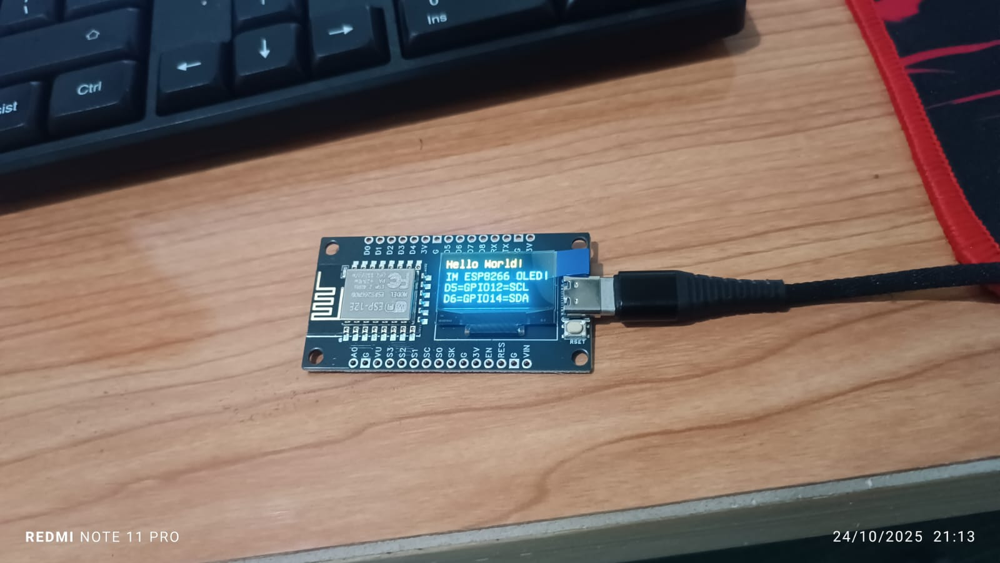

<!-- Social Preview Metadata -->
<meta property="og:title" content="Mini Gateway — Web-Configurable IoT Gateway for ESP8266">
<meta property="og:description" content="Smart dual-mode Wi-Fi gateway with JSON API, web dashboard, and DHCP scanner for Wemos D1 mini. Built with Arduino and ESP8266WebServer.">
<meta property="og:image" content="https://raw.githubusercontent.com/sismadi/mini-gateway/main/docs/esp8266oled.jpeg">
<meta property="og:type" content="website">
<meta property="og:url" content="https://github.com/sismadi/ESP8266-OLED-WiFi-JSON">
<meta name="twitter:card" content="summary_large_image">

<!-- Banner -->
<p align="center">
  
</p>

# 🛰️ ESP8266 NodeMCU + OLED WiFi Manager & JSON Client


## 📘 Deskripsi Proyek

Proyek ini menampilkan **web interface setup WiFi & API**, **scanner jaringan Wi-Fi**, serta **client viewer JSON API** dengan tampilan di **OLED SSD1306 (128x64)**.
Cocok digunakan untuk proyek **IoT gateway mini**, **WiFi monitor**, atau **tester koneksi API**.

ESP8266 berfungsi ganda sebagai:

* **Access Point (AP)** — untuk konfigurasi melalui web setup.
* **Station (STA)** — untuk terhubung ke jaringan WiFi utama dan melakukan HTTP/HTTPS GET/POST JSON.

---

## ✨ Fitur Utama

| Fitur                    | Deskripsi                                                                             |
| ------------------------ | ------------------------------------------------------------------------------------- |
| 🌐 **AP + STA Mode**     | Menyediakan portal setup pada `192.168.4.1` (SSID: `SetupNodeMCU`, Pass: `12345678`). |
| ⚙️ **Web Setup Page**    | `/` → Form konfigurasi SSID, Password, API GET & API POST.                            |
| 💾 **EEPROM Config**     | Menyimpan SSID, Password, dan URL API agar tetap tersimpan setelah restart.           |
| 📡 **Wi-Fi Scanner**     | `/scan` (HTML), `/scan.json` (API), `/scan_oled` (menampilkan Top-3 SSID di OLED).    |
| 👥 **AP Clients**        | `/clients` (HTML), `/clients.json` (API).                                             |
| 🖥️ **OLED Display**     | Menampilkan status, hasil GET JSON, dan pesan sistem (dengan word-wrap otomatis).     |
| 🔒 **HTTP/HTTPS JSON**   | Mendukung GET dan POST JSON (HTTPS via `WiFiClientSecure.setInsecure()`).             |
| 🔁 **Auto Fetch & Post** | GET tiap 10 detik, POST tiap 30 detik (opsional).                                     |

---

## 🧩 Wiring Diagram

| Komponen | NodeMCU Pin | Keterangan |
| -------- | ----------- | ---------- |
| OLED SDA | D5 (GPIO14) | I2C Data   |
| OLED SCL | D6 (GPIO12) | I2C Clock  |
| OLED VCC | 3V3         | Daya       |
| OLED GND | GND         | Ground     |

> 🟢 **I2C Address**: `0x3C`

---

## 🖥️ Tampilan Web Setup

**URL Akses:**
`http://192.168.4.1/`

**Menu:**

* `GET /` — Halaman konfigurasi WiFi & API.
* `GET /save` — Simpan konfigurasi.
* `GET /scan` — Daftar jaringan WiFi sekitar.
* `GET /scan.json` — API JSON daftar jaringan.
* `GET /scan_oled` — Tampilkan 3 sinyal WiFi terkuat di OLED.
* `GET /clients` — Daftar perangkat terhubung ke AP.
* `GET /clients.json` — API JSON daftar klien.

---

## 🔧 Struktur Konfigurasi EEPROM

```cpp
struct Config {
  uint32_t magic;    // "CFG1"
  char ssid[32];
  char pass[32];
  char apiGet[128];  // contoh: https://jsonplaceholder.typicode.com/users/1
  char apiPost[128]; // contoh: https://api.example.com/iot/post
};
```

---

## 🖼️ Tampilan OLED

* Bar atas: Judul besar (dua warna, bagian atas kuning)
* Isi tengah: Word-wrap otomatis
* Bar bawah: Informasi tambahan atau footer
* Contoh:

  ```
  WiFi OK
  192.168.1.10
  AP: 192.168.4.1
  ```

---

## ⚙️ API Contoh

### 🔹 GET JSON

```text
https://jsonplaceholder.typicode.com/users/1
```

OLED akan menampilkan nilai dari properti `name`, `nama`, `message`, atau `title`.

### 🔹 POST JSON

```json
{
  "device": "ESP8266-ESP12E",
  "rssi": -56,
  "uptime_ms": 123456
}
```

---

## 📦 Library yang Dibutuhkan

Pastikan library berikut terinstal di Arduino IDE:

* `ESP8266WiFi`
* `ESP8266WebServer`
* `ESP8266HTTPClient`
* `WiFiClientSecure`
* `Adafruit_GFX`
* `Adafruit_SSD1306`
* `ArduinoJson`
* `EEPROM`

---

## 🚀 Cara Upload

1. Buka **Arduino IDE** (≥1.8.19).
2. Pilih board: **NodeMCU 1.0 (ESP-12E)**.
3. Atur upload speed: `115200`.
4. Upload kode dan buka Serial Monitor.
5. Hubungkan WiFi ke SSID `SetupNodeMCU` → akses `192.168.4.1`.

---

## 🧠 Logika Utama

* Boot → Inisialisasi OLED + EEPROM.
* Start AP + STA.
* Jalankan web server setup.
* Loop:

  * `fetchAndDisplayJson()` setiap 10 detik (GET).
  * `maybePostJson()` setiap 30 detik (POST bila URL tersedia).

---

## 🧰 Penggunaan Lanjut

Anda dapat mengintegrasikan dengan API IoT, seperti:

* Supabase REST API
* Cloudflare Workers
* Node.js / PHP JSON endpoint
* Google Sheets API (via WebApp)

---

## 📜 Lisensi

Proyek ini dirilis di bawah **MIT License** — bebas digunakan untuk tujuan pendidikan, penelitian, maupun komersial dengan mencantumkan atribusi.

---

## 👤 Kontributor

**Wawan Sismadi**
📡 [GitHub: sismadi](https://github.com/sismadi)
💡 Proyek: *Mini Gateway — ESP8266 Web + OLED JSON Client*

